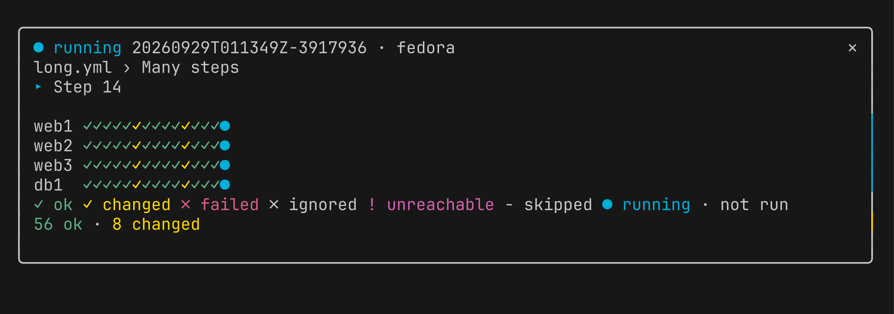
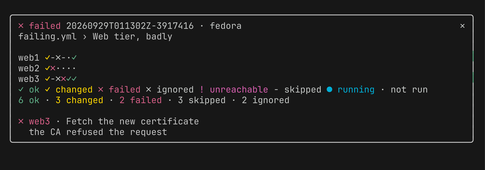

<div align="center">

# ansible-live

**Watch a running `ansible-playbook` from a Claude Code pane: the task in progress, every host's outcome, and the latest failure, as it happens.**

[](LICENSE)



</div>

```bash
# From a clone: the recorder (an Ansible callback) and the pane (a Claude Code plugin)
ansible-galaxy collection install ./ansible_collections/igouss/ansible_live
claude plugin marketplace add . && claude plugin install ansible-live@ansible-live
```

> **Status:** pre-release (0.1.0). Install from GitHub or a clone; not on Ansible Galaxy yet.

---

## TL;DR

**The problem.** A playbook runs for minutes across many hosts. Its output scrolls away in whatever
terminal started it, and when you work in Claude Code, that terminal is often not the one you are
looking at. To learn which task is running and which host failed, you scroll back or wait for the recap.

**The solution.** A callback records each run, event by event, to a log of its own. `/ansible-live`
opens a pane in Claude Code that follows those logs and redraws as each event lands. Any playbook,
any inventory, started from Claude or from any other terminal on the machine.

| | |
|---|---|
| **Live** | The pane updates as each host starts and finishes each task. |
| **At a glance** | One row per host, one cell per task, coloured by outcome; the results summed below. |
| **The failure, not the scroll** | The latest failed or unreachable host, its task, and what the task said. |
| **Every run** | Concurrent runs and the last 100 are one keypress away (`o` older, `n` newer, `l` live). |
| **Honest about dead runs** | A run killed without finishing shows as *lost*, not *running* forever. |
| **No secrets recorded** | No task arguments, no result dumps, no extra-var values; logs are readable by you alone. |

## Quick example

```bash
# 1. Once: install the callback, and enable it (here for this shell; ansible.cfg for good, see Quick start)
ansible-galaxy collection install ./ansible_collections/igouss/ansible_live
export ANSIBLE_CALLBACKS_ENABLED=igouss.ansible_live.live

# 2. Once: install the pane
claude plugin marketplace add /path/to/ansible-live
claude plugin install ansible-live@ansible-live

# 3. Run a playbook, from any terminal
ansible-playbook -i inventory.yml site.yml
```

Then, in Claude Code:

```
/ansible-live
```

The pane shows the run in progress (or else the newest run):

```
● running 20260929T011349Z-3917936 · fedora
long.yml › Many steps
▸ Step 14

web1 ✓✓✓✓✓✓✓✓✓✓✓✓✓✓●
web2 ✓✓✓✓✓✓✓✓✓✓✓✓✓✓●
web3 ✓✓✓✓✓✓✓✓✓✓✓✓✓✓●
db1  ✓✓✓✓✓✓✓✓✓✓✓✓✓✓●
✓ ok ✓ changed ✗ failed ✗ ignored ! unreachable - skipped ● running · not run
56 ok · 8 changed

[ older ] [ newer ] [ live ] run 19 of 19 · live
```

and once it fails, where and why:



## Design philosophy

1. **The log is the stream.** The recorder appends each event to its run's log as it happens. A log
   keeps a run nobody was watching, and a pane opened later reads it from the start. Nothing is
   pushed to a listener that may not be there.
2. **One contract couples the two sides.** `contract/SPEC.md` (requirements FR-1 to FR-18, JSON
   schemas, example logs) is all the recorder and the pane share. Both are tested against it. A
   recorder newer than the pane is named, not misread (FR-15).
3. **Never show a dead run as running.** When a run's process is gone without writing its end, the
   pane says *lost*. The order that decides it (see the pid dead, then read the log to its end) is
   model-checked in TLA+ (`contract/formal/Follow.tla`); the naive order is checked to fail.
4. **Record what happened, not what was passed.** Task arguments, result dumps and extra-var values
   are never written; a result keeps at most 4000 characters of what the task said. Logs are mode 0600.
5. **Nothing runs while you are not looking.** The pane's follower starts when the pane opens and is
   killed when it closes.

## How it compares

| | ansible-live | Terminal output | [ARA](https://ara.readthedocs.io/) | AWX / Automation Platform | OpenTelemetry callback |
|---|---|---|---|---|---|
| Where you watch | A Claude Code pane | The terminal that started the run | Its web UI or CLI | Its web UI | Your tracing backend |
| Updates while the run goes | Yes | Yes | Yes, recorded as it runs | Yes, for jobs it launches | No: spans are built at the end of the playbook |
| Runs started from any terminal | Yes | No | Yes | No, only its own jobs | Yes |
| Extra service to run | None | None | Its API/UI server to browse | The platform | A collector and backend |
| Host × task grid | Yes | No | Per-playbook reports | Per-job host summary | As spans |
| Keeps history | Last 100 runs (`keep`) | Scrollback | Database | Database | Backend's retention |

Use ARA or AWX when you need a searchable history or a team UI; ansible-live is for watching runs on
your own machine without leaving Claude Code.

## Installation

Needs: `ansible-core` (declared `>=2.19`, tested with 2.21), Python 3.11 or newer on the machine that
runs the playbooks (checked with 3.11 to 3.14), and Claude Code with plugin hooks (tested with 2.1.284).
The pane must run on the machine whose logs it reads.

### From a clone (works today)

```bash
git clone <this repository> ansible-live && cd ansible-live

# The recorder: an Ansible collection, from its folder
ansible-galaxy collection install ./ansible_collections/igouss/ansible_live

# The pane: the repository is its own plugin marketplace
claude plugin marketplace add "$PWD"
claude plugin install ansible-live@ansible-live
```

### From GitHub

```bash
ansible-galaxy collection install "git+https://github.com/igouss/ansible-live.git#/ansible_collections/igouss/ansible_live/"
claude plugin marketplace add igouss/ansible-live
claude plugin install ansible-live@ansible-live
```

### Without installing (to try it, or while changing it)

```bash
# Use the collection in place: point Ansible at the clone
ANSIBLE_COLLECTIONS_PATH=/path/to/ansible-live ANSIBLE_CALLBACKS_ENABLED=igouss.ansible_live.live ansible-playbook site.yml

# Load the pane for one session
claude --plugin-dir /path/to/ansible-live/viewer/plugin
```

## Quick start

1. Install both halves (above).
2. Enable the callback, in the `ansible.cfg` your playbooks use:
   ```ini
   [defaults]
   callbacks_enabled = igouss.ansible_live.live
   ```
   or for one shell: `export ANSIBLE_CALLBACKS_ENABLED=igouss.ansible_live.live`.
3. Run any playbook. A log appears in `~/.local/state/ansible-live/` (or `$XDG_STATE_HOME/ansible-live/`).
4. In Claude Code, type `/ansible-live`.
5. To step between runs, give the pane the keyboard (ctrl+x tab) and press `o`, `n` or `l`.

## Commands and keys

| Where | What | Does |
|---|---|---|
| Claude Code prompt | `/ansible-live` | Opens the pane and starts following. |
| Pane (after ctrl+x tab) | `o` | Shows the run older than the one shown. |
| | `n` | Shows the run newer than the one shown. |
| | `l` | Back to live: the newest running run, else the newest. |
| | `q` | Closes the pane and stops the follower. |

What the pane shows, top to bottom:

| Section | Example |
|---|---|
| State, run id, controller, check mode, limit | `● running 20260929T011349Z-3917936 · fedora · check mode · limit web*` |
| Playbook › play | `site.yml › Web tier` |
| Task in progress | `▸ Restart nginx (handler)` |
| Grid: a row per host of the play, newest task last, as many as fit | `web1 ✓✓-✗●` |
| Legend, then totals and tasks the grid had no room for | `24 ok · 4 changed · 1 failed · 3 earlier tasks not shown` |
| Latest failure: host, task, up to 8 lines of what it said | `✗ web3 · Fetch the new certificate` |
| Notes: follower trouble, newer recorders, unreadable lines | `A newer recorder (v2) wrote this run; update ansible-live to read it.` |
| Position among the runs | `run 21 of 23 · live` |

States: `● running`, `✓ ok`, `✗ failed`, `■ interrupted` (Ctrl-C), `? lost` (the process is gone and
its log has no end).

## Configuration

The recorder, in `ansible.cfg` (every key optional):

```ini
[defaults]
callbacks_enabled = igouss.ansible_live.live

[callback_live]
# Where the logs go. Default: $XDG_STATE_HOME/ansible-live, else ~/.local/state/ansible-live.
dir = /var/tmp/ansible-live
# How many logs to keep; the oldest go when a run starts. Default: 100.
keep = 100
```

or from the environment: `ANSIBLE_LIVE_DIR`, `ANSIBLE_LIVE_KEEP`.

The pane, in Claude Code's `/config`:

| Option | Default | Set it when |
|---|---|---|
| `dir` | empty: the callback's default | the callback writes elsewhere (`dir` or `ANSIBLE_LIVE_DIR` above) |
| `python` | `python3` | `python3` on `PATH` is older than 3.11, or missing |

## Architecture

```
 ansible-playbook                                    Claude Code
 ┌──────────────────────┐                            ┌──────────────────────────────────────┐
 │ callback             │  append one JSON event     │ /ansible-live opens the pane         │
 │ igouss.ansible_live  │  per line (contract v1)    │                                      │
 │ .live                ├──────────┐                 │ Watch ──spawns──▶ python3 -m follower│
 └──────────────────────┘          ▼                 │   ▲                   │              │
                     ~/.local/state/ansible-live/    │   │ stdout: the stream│ reads new    │
                     <run>.jsonl  (mode 0600,        │   │ (FR-12 to FR-14)  │ lines; sees  │
                     newest 100 kept)  ◀─────────────┼───┼───────────────────┘ dead pids    │
                                                     │   │                                  │
                                                     │ decode ─▶ fold ─▶ view ─▶ pane       │
                                                     │ (pure TypeScript, no Claude Code API)│
                                                     └──────────────────────────────────────┘
```

| Part | Where | Does |
|---|---|---|
| Contract | `contract/` | `SPEC.md`, JSON schemas, example logs, `check.py`, the TLA+ model of following |
| Recorder | `ansible_collections/igouss/ansible_live/` | The callback; a pure core (`plugin_utils/recording.py`) turns what Ansible reports into events |
| Follower | `viewer/plugin/follower/` | Python, standard library only: follows every unended run, the newest, the runs asked for and every new one; says `run.lost` for a dead process on this host |
| Pane core | `viewer/plugin/core/` | `decode` a line, `follow` it into the stream's runs, `glance` where a run is, `choice` which run to show, `view` what to draw at a width |
| Pane shell | `viewer/plugin/shell/`, `hooks/register.tsx` | The `Watch` (the follower through ports), the drawing, the command and the pane's lifecycle |

## Troubleshooting

| You see | Why | Fix |
|---|---|---|
| `No runs yet` and `Logs are read from …` | The callback is not enabled, or writes to another directory | Check `callbacks_enabled` in the `ansible.cfg` the playbook actually uses (`ansible-config dump --only-changed`); if the callback's `dir` is set, set the pane's `dir` to match |
| `The follower did not start (python3 -m follower …)` | No `python3` on the `PATH` Claude Code sees | Set the pane's `python` option to a Python 3.11+ path |
| `The follower stopped (exit N): …` | The follower crashed; the text after the colon is its standard error | Report it with that text; reopen the pane to restart it |
| A killed run still shows `● running` | It ran on another host (the pane can only check pids on its own), or its pid was reused | Expected for runs from other machines; once `keep` prunes its log, reopening the pane drops it |
| `A newer recorder (vN) wrote …` | The callback is newer than the pane | Update the plugin: `claude plugin marketplace update ansible-live`, then reinstall |
| `N unreadable lines; the latest: …` | Something wrote lines the contract does not allow into the log directory | Check for other writers in the directory; the reason names the first field that failed |
| The pane stopped changing while a run went on | Seen once, cause unknown (tracked) | Close the pane and run `/ansible-live` again; it rereads the logs |

## Limitations

- **Same machine only.** The pane reads the log directory directly; runs on other controllers show only
  through a shared home, and then cannot be told apart from killed ones (they stay *running*).
- **Not recorded:** loop items one by one, diffs, async polls, task arguments, result dumps, extra-var
  values. A result's message is cut at 4000 characters.
- **The latest play only.** The grid shows the play (or `serial` batch) in progress; earlier plays of
  the run are not drawn.
- **Large inventories are slow to catch up.** Reading a 100,000-line log takes about 1.4 s at 50 hosts
  and 9 s at 500 hosts.
- **One unexplained stall.** In one of several live runs the pane stopped updating mid-run while the
  logs grew; not reproduced since.
- **Claude Code's plugin hooks are early access**; an update can change the API the pane is written
  against (`viewer/types/claude-code.d.ts` records the version).
- **Tested on Linux (Fedora) only.**
- **Not on Ansible Galaxy yet**: install the collection from GitHub or a clone.

## FAQ

**Does it slow my playbooks down?**
It appends one line to a local file per event, with no network and no parsing of results beyond their
outcome and message.

**Can a log leak secrets?**
It never records task arguments or extra-var values. It does keep what a task said (its `msg`, a failed
assertion, `stderr`), up to 4000 characters, which is why logs are readable by their owner alone.

**Does it work with runs started outside Claude Code?**
Yes. Any `ansible-playbook` with the callback enabled, from any terminal, cron job or script on the same
machine, shows up.

**Can I watch two runs at once?**
The pane shows one run at a time and follows all of them; `o` and `n` step between them, `l` returns to
the newest running one.

**Why not OpenTelemetry?**
The `community.general.opentelemetry` callback builds its spans when the playbook ends, and OTLP
exports only ended spans, so there is nothing to watch while the run goes.

**Where are the logs, and can I read them without the pane?**
In `~/.local/state/ansible-live/<run>.jsonl`, one JSON event per line, as `contract/SPEC.md` describes.
`jq` reads them.

**Why a pane and not a status line?**
A status line has room for one task; the pane has room for every host's outcome and the failure.

## Development

Once per clone: `uv sync` (Python) and `cd viewer && npm ci` (TypeScript).

| Recipe | Runs |
|---|---|
| `just verify` | Every offline check: `test`, `pane`, `formal`, `testbed` |
| `just test` | pytest (contract, recorder, follower), `tsc` over the viewer and the plugin, vitest (units and Hegel properties) |
| `just pane` | `claude plugin validate --strict` and `claude plugin test`: the pane mounted on the terminal and desktop surfaces over fake followers |
| `just formal` | TLC over `contract/formal/Follow.tla`, and the naive order seen failing (needs a `tlc` wrapper on `PATH`) |
| `just testbed` | Every testbed playbook, each required to end with the exit code it is built for |
| `just mutate` | mutmut over the recorder and follower (survivors must be exactly `mutation-equivalents.txt`) and Stryker over the pane core and `Watch` (no survivors) |
| `just play <name>` | One testbed playbook; `just play long -e steps=500 -e pace=0` |

`testbed/` is an Ansible project of this machine under several names (`web1`–`web3`, `db1`) plus
`ghost1`, which nothing answers for; the callback is enabled in its `ansible.cfg`.

| Playbook | Shows |
|---|---|
| `clean` | two plays, a loop, a skipped task, a handler |
| `failing` | one host failing, one failure ignored, one rescued |
| `unreachable` | `ghost1`, which nothing answers for |
| `long` | `steps` tasks per host, each taking `pace` seconds |

`viewer/types/claude-code.d.ts` is Claude Code's plugin API as of the version on its first line;
`/plugin-types viewer/types` refreshes it.

## About Contributions

> *About Contributions:* Please don't take this the wrong way, but I do not accept outside contributions for any of my projects. I simply don't have the mental bandwidth to review anything, and it's my name on the thing, so I'm responsible for any problems it causes; thus, the risk-reward is highly asymmetric from my perspective. I'd also have to worry about other "stakeholders," which seems unwise for tools I mostly make for myself for free. Feel free to submit issues, and even PRs if you want to illustrate a proposed fix, but know I won't merge them directly. Instead, I'll have Claude or Codex review submissions via `gh` and independently decide whether and how to address them. Bug reports in particular are welcome. Sorry if this offends, but I want to avoid wasted time and hurt feelings. I understand this isn't in sync with the prevailing open-source ethos that seeks community contributions, but it's the only way I can move at this velocity and keep my sanity.

## License

MIT; see [LICENSE](LICENSE).
